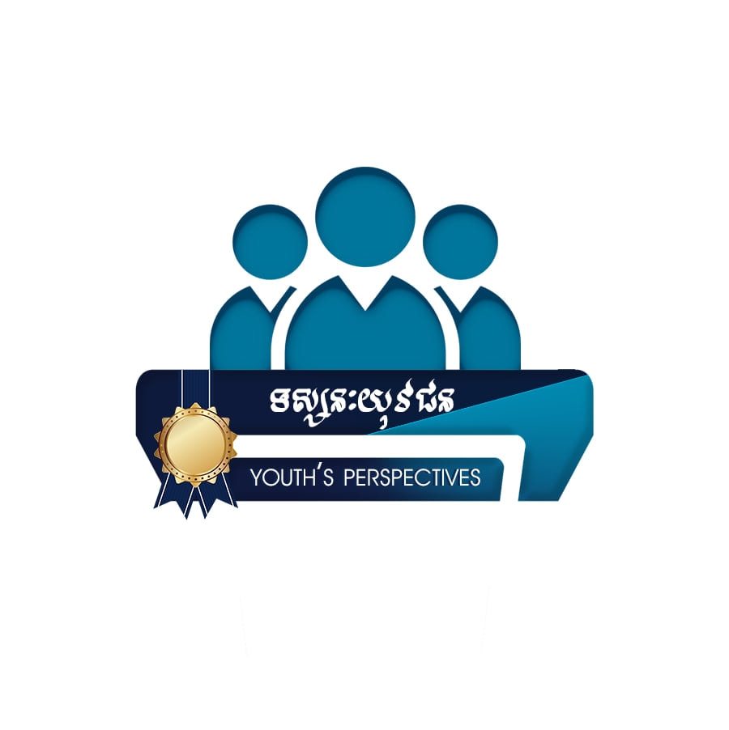
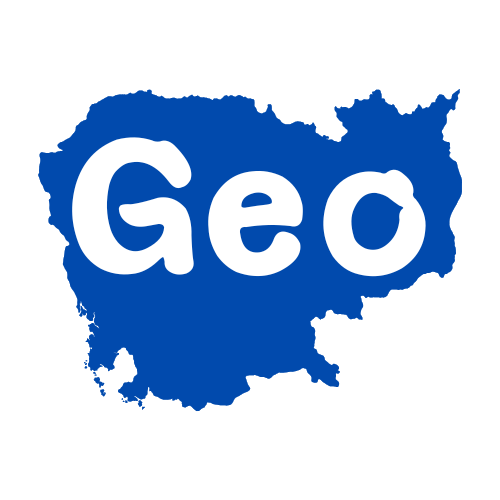
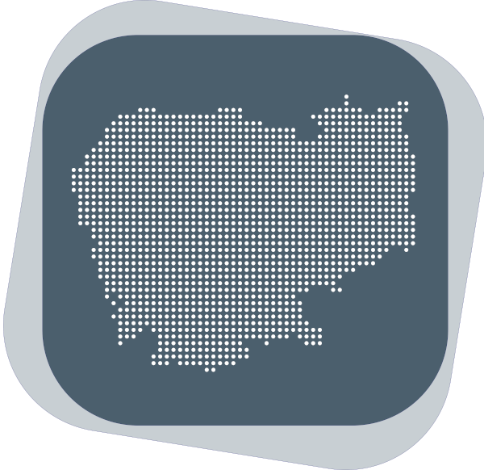
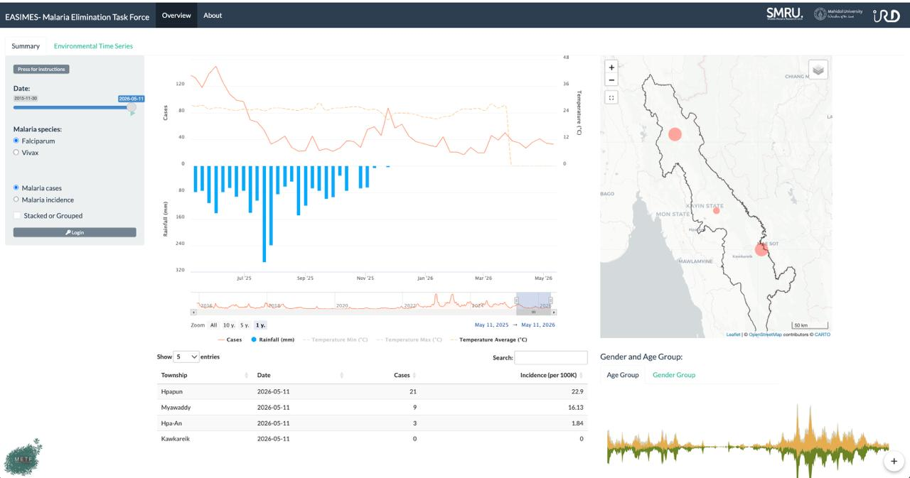

::::{grid} 1 1 2 2

:::{grid-item}
:columns: 12 12 4 4

```{image} Chamroeun_photo.jpg
:alt: Chamroeun YORNGSOK
:width: 95%
```

:::

:::{grid-item}
:columns: 12 12 8 8

**Environmental Data Scientist (R Developer)** | **Project Leader**

[IRD Cambodge](https://geohealthresearch.org/), GeoHealth Research Team

[1Russian Federation Blvd (110)](https://maps.app.goo.gl/kTd4CnQi8HufZcsZ6), Phnom Penh, 120404

[chamroeunyorngsok@gmail.com](mailto:chamroeunyorngsok@gmail.com) 

**Research Interests:** Climate Change, Data Science, Geospatial Analysis, Remote Sensing, Public Health

[CV (PDF)](cv.pdf) |
<!-- [Google Scholar](https://scholar.google.com) |
[ORCID](https://orcid.org/0000-0000-0000-0000) | -->
[LinkedIn](https://www.linkedin.com/in/chamroeun-yorngsok/) |
<!-- [GitHub](https://github.com/username) |
[Twitter](https://twitter.com/username) -->

:::
::::

---

## Featured Projects

::::{grid} 2 2 4 4

:::{card}
:link: https://www.facebook.com/rulers.community

+++
**RULErs Community**
:::

:::{card}
:link: https://www.facebook.com/youthsperspectiveskh

+++
**Youth's Perspectives**
:::

:::{card}
:link: https://geocambodia.org/

+++
**GeoCambodia, affliated with IRD Cambodge**
:::

:::{card}
:link: https://cised.kheobs.org/

+++
**CISED-Dengue Cambodia, affliated with IRD Cambodge**
:::

:::{card}
:link: https://cised.kheobs.org/

+++
**EASIMES, affliated with IRD Cambodge**
:::

<!-- :::{card}
:link: https://jupyter.org

+++
**Jupyter**
::: -->

<!-- :::{card}
:link: https://python.org

+++
**Python**
::: -->

::::

---

<!-- ## Highlights

::::{grid} 2 2 3 4

:::{card} Publications 📚
:link: pages/research
10+ Refereed Publications
:::

:::{card} Software 💻
:link: pages/software
5+ Open-Source Projects
:::

:::{card} Teaching 🎓
:link: pages/teaching
5+ Courses Taught
:::

:::{card} Talks 🎤
:link: pages/talks
10+ Invited Talks
:::

:::{card} Awards 🏆
:link: pages/awards
5+ Awards & Honors
:::

:::{card} Community 🌍
:link: pages/services
Professional & institutional service
:::

:::{card} Blog ✍️
:link: pages/blog
Thoughts on research, software, and teaching
:::

:::{card} News 📰
:link: pages/news
Latest updates and milestones
:::

::::

---

## Recent News

- **2026-04-01** - Launched personal website with MyST Markdown
- **2026-03-15** - Published new paper on machine learning
- **2026-02-01** - Released version 2.0 of open-source project
- **2026-01-10** - Received Best Paper Award at Conference 2026 -->

<!-- [See all news →](pages/news) -->
